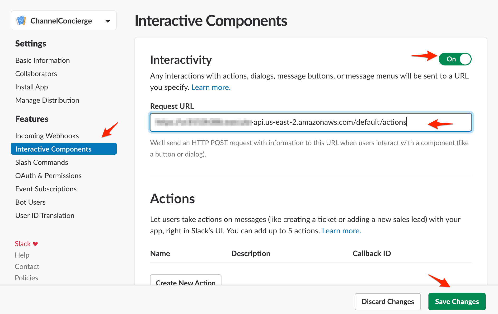

# Step3: Adding buttons to messages

As a third step, we're going to modify the message posted when a user joins a channel, giving them an option to confirm that they've read it. 

### Adding an interactive endpoint to our app

Just like events send a payload to a specific endpoint, [buttons, menus, dialogs, actions](https://api.slack.com/interactive-messages) will send a query to an endpoint of our choice.
The endpoint and its corresponding Lambda have been built by CloudFormation, so we'll just need to configure our Slack app to let it know where to send those requests, and 

- Open CloudFormation again. In the "Outputs" tab, grab the "apiGatewayActionsURL"
- Go back to your Slack App's config (from https://api.slack.com/apps, click on your app's name), and click on "Interractive Components" (left column). Paste your endpoint's URL in the "Request URL" field.
- Don't forget to hit "Save Changes"!

### Configuring the ActionsAPI Lambda

The Lambda function handling the button clicks payloads has already been configured by CloudFormation, so we'll just need to update its environment variables.

- In your Slack app's config, click on "Basic Information" (left column), and scroll down to "verification token". Copy that value, and go back to your AWS account. Open Lambda, and click on the "ActionsAPI" function that was created by CloudFormation. Scroll down to "environment variables", and you should see an "APP_TOKEN" variable with a placeholder value. Replace that value with your the verification token you just copied.

- Go back to your Slack app's config, click on "Install App" (left column), and scroll down to "bot token". As above, use that value for the "BOT_TOKEN" environment variable.
Note: make sure to use the bot token, starting in `xoxb`

### Configuring the EventsAPI Lambda

As before, we'll change the handler to point to the right version.

- Open your EventsAPI Lambda function, and under Function code, you'll see a "Handler" box. Replace `event_step2.event_handler` with `event_step3.event_handler`, and hit save.

### Getting an updated welcome message

- Invite your bot to a channel: you will only receive events if your bot is a member of the channel
- Set a purpose / topic
- Leave and rejoin to trigger the `member_joined_channel` event, or invite a new user to the channel
- The joining user will receive an ephemeral message from the bot, this time with a button
- Clicking the button will post a message in the channel

## Taking this further

This app gives you an overview of the following components:

- the Events API, which allows you to receive payloads when specific events occur. They can be used to keep track of specific events, or as we did here, to trigger workflows.
You can try subscribing to additional events, as we did in step2, by adding the corresponding logic to the code.
[More about the Events API](https://api.slack.com/events-api)

- The Web API, to programmatically read and write Slack data. Here we've used the `conversations.info` endpoint to grab more details about the channel that was just joined, and `chat.postEphemeral` and `chat.postMessage` to post messages.
[Full list of API methods](https://api.slack.com/methods)

- Interactive messages allow users to interact with your app via buttons, menus, and actions. They give your app more ways to get input from users and allow you to create quick and powerful worflows. 
We've used a fairly simple example here (one button), but adding more buttons and menus would use the same endpoint and a similar logic.
[More about interactive messages](https://api.slack.com/interactive-messages)

