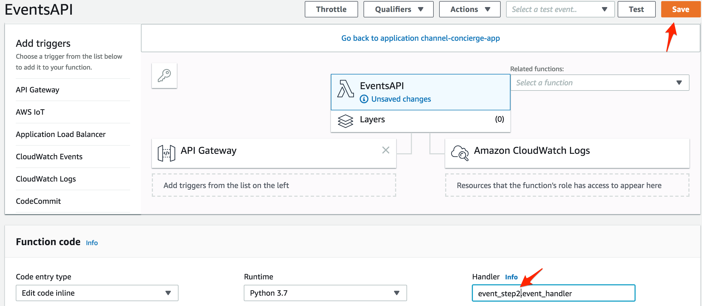

# Step2: Getting our app triggered when a user joins a channel and using the Web API

As a second step, we're going to modify our app so that it starts listening to the event generated when users join channels, and then we'll leverage the Web API to get the channel's topic and purpose, and send the joining user a message.

## Subscribing to additional events

- Go back to your app's config page (from https://api.slack.com/apps, click on your app's name)
- Click on "Event Subscriptions" (left column), and under "Subscribe to Bot Events", click on "add Bot User Event". Then, select `member_joined_channel` and hit "Save Changes" at the bottom of the page.

Your app is now configured to receive payloads when a user joins a channel your bot user is a member of. Let's make sure our lambda function is able to handle them.

## Updating the function called by the EventsAPI lambda

- Open your EventsAPI Lambda function, and under Function code, you'll see a "Handler" box. This is where we tell Lambda which python function should be ran when a request is received. The CloudFormation template we ran uploaded the code and dependencies for the 3 different steps, so we'll only need to point the handler to the right function: replace `event_step1.event_handler` with `event_step2.event_handler`, and hit save.

You may want to take a moment to to compare both versions of the code.You'll notice that they're very similar: we've only added instructions for the new type of event that our app is receiving.
When the app detects a `member_joined_channel`, it will grab the relevant info from the event payload, and use it to call the `conversations.info` endpoint of Slack's web API. The response will be used to build a message, sent to the user with the `chat.postEphemeral` endpoint.
We've also modified the bot's answer to Direct Messages: your users may try to message your bot, so it's helpful to provide info about how to use the bot there.

## Getting a welcome message

- Invite your bot to a channel: you will only receive events if your bot is a member of the channel
- Set a purpose / topic
- Leave and rejoin to trigger the `member_joined_channel` event, or invite a new user to the channel
- The joining user will receive an ephemeral message from the bot.

