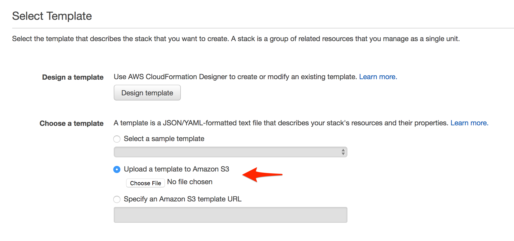
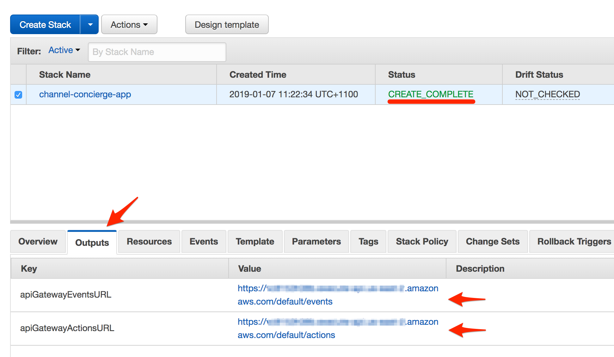
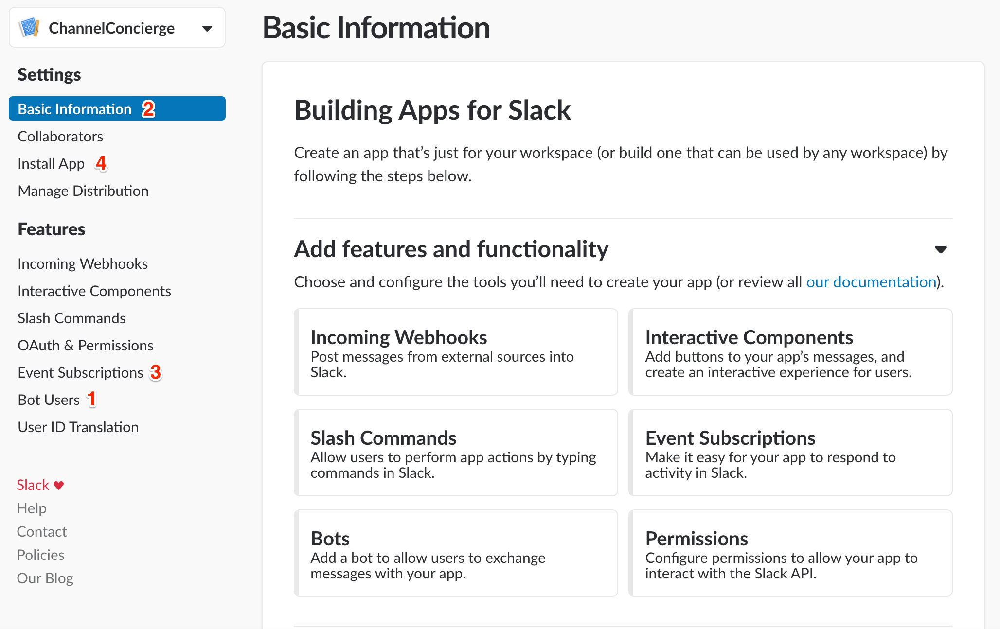
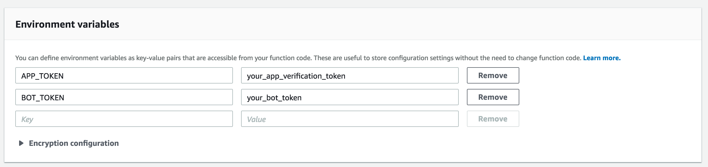
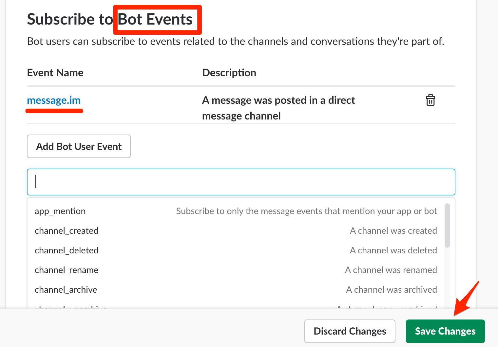
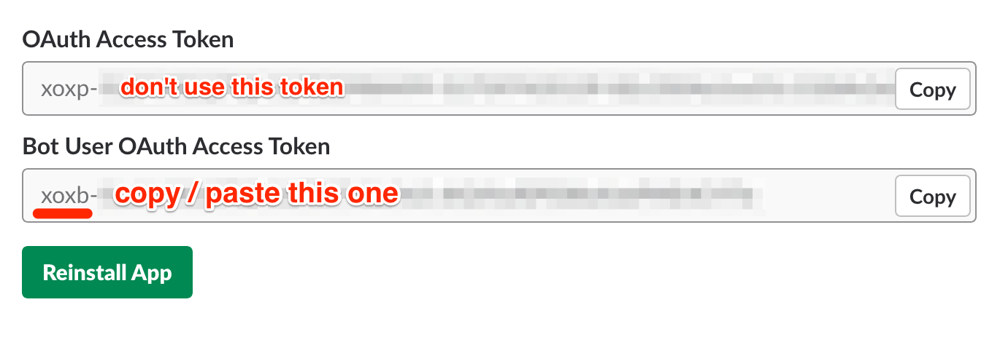
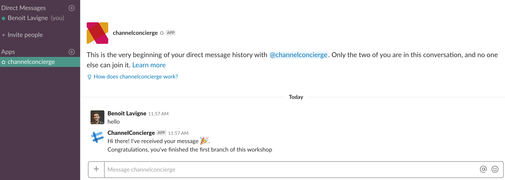
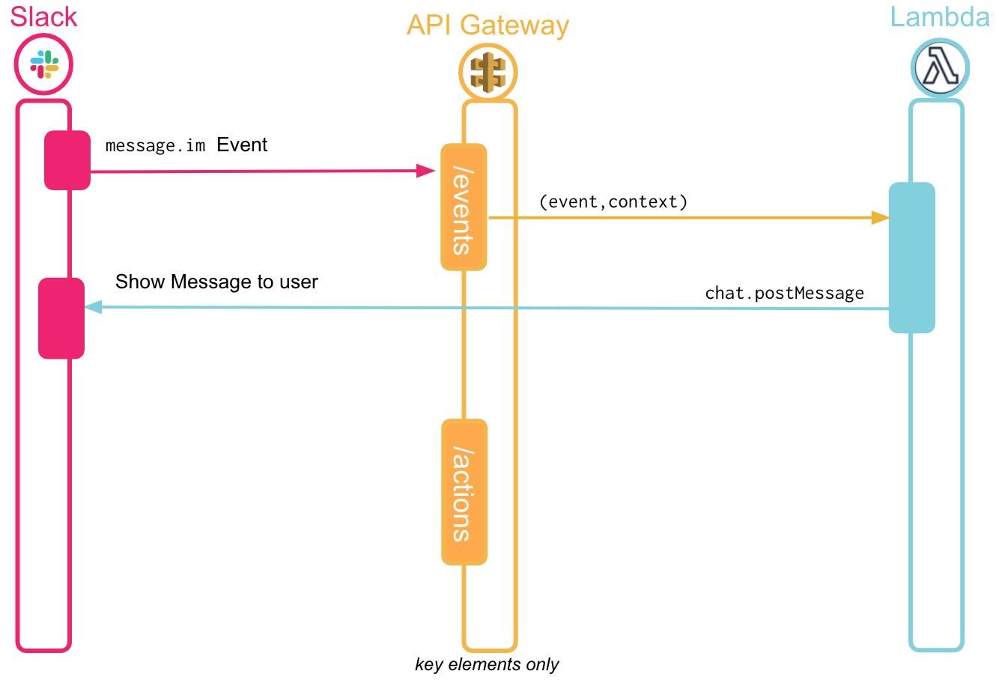

# Step1: Building a Slack app listening and replying to messages

As a first step, we're going to build a Slack app listening and replying to a simple type of events: messages sent to it in a Direct Message.
While our app leverages a bot user, it's not a conversational app. However, users may still try to send your app messages so it's usually useful to provide some kind of helpful message explaining how to use your app.

Building this component will allow us to ensure that our app is able to subscribe to and receive events, and it will be easy to test: once you're done with the config, send a direct message to your app. If it replies, you're ready to move to step 2!

We're going to need to configure both our Slack app and AWS, which will require a bit of back and forth between the two services. Let's start on AWS' side as we'll need to get our server running before we can configure our Slack App.

## Creating endpoints and corresponding lambdas

We're going to use AWS' CloudFormation to automatically configure the API Gateway's endpoints and their corresponding Lambda functions. 

- Download the channel-concierge.yaml file provided here
- Log in to your AWS account, and open Cloudformation
- Make sure you're currently in the "Asia Pacific (Sydney)" region
- Click on "Create Stack", and under "Choose a template" use the "Upload a template to Amazon S3" option. Select the yaml file you just downloaded

- You'll be asked for a Stack name – This can be anything that makes sense for you, for Instance "Slack-Channel-Concierge-App"
- On the next screen ("Options"), scroll down and click "next", leaving all the settings to their default values.
- Review your Stack on the final screen, tick the Capabilities box and hit "Create"
- CloudFormation will then take a few minutes to create the different endpoints, resources and lambdas
- Once the Stack has reached the "CREATE_COMPLETE" status, it's ready to be used. If you click on "Outputs", you'll see two URLs: they are where we'll configure our Slack app to send events (step1 and step2) and button click requests (step3).

## Creating your Slack app, adding a bot user and subscribing to events:

The app will be the container for the different API elements we're going to use.

- Open up your [app's list](https://api.slack.com/apps) and click on "Create New App". You will then be asked to pick a name for your app (for instance, channel-concierge) and on which workspace you'd like this app to live. Click on "create app" to finish creating your app.

- Click on "Bot users" (left column) and add a bot user to your app. By default, your bot will inherit your app's name. Click on "Add Bot User" to add the bot to your app.
[More info about Bot Users](https://api.slack.com/bot-users)

- Click on "Basic Information" (left column), and scroll down to "verification token". Copy that value, and go back to your AWS account. Open Lambda, and click on the "EventsAPI" function that was created by CloudFormation. Scroll down to "environment variables", and you should see an "APP_TOKEN" variable with a placeholder value. Replace that value with your the verification token you just copied and hit save.

Note: to keep this workshop simple, we're using a verification token here, but we'd recommend upgrading your app to us signing secrets: https://api.slack.com/docs/verifying-requests-from-slack

- Go back to your Slack app configuration page, and click on "Event Subscription" (left column). Toggle the event subscription (top right), and open CloudFormation again. In the "Outputs" tab, grab the "apiGatewayEventsURL", and paste it your Slack app's event's "Request URL". Slack will then send a request to your events endpoint, and the verification logic in your lambda should respond with the expected challenge parameter. This will validate your endpoint, and you can then subscribe to events.
Under "Subscribe to Bot Events", click on "Add Bot User Event" and start typing `message.im`. Select these events to configure your app to send payloads to AWS whenever a Direct Message is sent to your Bot.
Don't forget to hit save! Also, make sure you've subscribed to bot events, rather than workspace events.
[More info about the Events API](https://api.slack.com/events-api)

- Click on "Install App" (left column), and click on the "Install App to Workspace" button. Follow the instructions in the OAuth flow, authorizing and installing your app to your workspace. This will take you back to this install page, which will show two tokens: copy the bot token (starting in `xoxb`), and go back to your EventsAPI Lambda config: paste this value as the "BOT_TOKEN" environment variable and hit save.

- Open your Slack workspace, and then the DM with your bot. Sending any message here should trigger a response from the bot.

Got the reponse from the bot? Awesome! You can move on to the step2 branch!
Not getting a response? Check the troubleshooting steps below!

## How does this work?

- When you send a message to your bot, Slack will send a payload to our Events endpoint.
- The payload will be directed to your EventsAPI Lambda Function, which will parse the JSON data and check the event's type.
- If the event is a message (which should always be the case if you've subscribed to the right events!), the app will grab the channel id from the payload, and use it to respond by calling the `chat.postMessage` endpoint of Slack's webAPI.

## Troubleshooting

If you're not getting a response, check the following:

- Is your "Event Subscription" endpoint configured, and did the URL validate? 
If you're seeing a 500 when validating the URL, you're probably not using the right endpoint. 
If you're seeing a 403, that means the verification token value is not properly configured

- Are you subscribing to the correct event (`message.im`)?

- Can you see the event request in your logs? 
If you see the event but your bot isn't able to post a response, check that you've got the right value for the BOT_TOKEN environment variable

